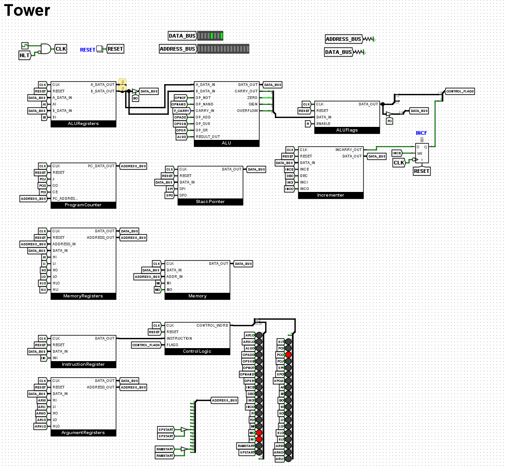

# Tower
A custom 8-bit minicomputer and architecture designed for educational purposes.

## About
I started this project to learn about computer architecture but I soon realized, it could be much more and that it could become a model for students to learn about computers at the lowest level.

## Images

***Image 1: Logisim circuit***